# Profit Splitter 

## Ethereum Smart Contracts with Solidity, Remix IDE, MetaMask and Ganache

Source: [Pixabay](https://pixabay.com/photos/cryptocurrency-money-ethereum-3424785/)

This repo shows three examples of Ethereum Smart Contracts which were created in [Solidity](https://docs.soliditylang.org/en/v0.7.4/) programming language using [Remix IDE](https://remix.ethereum.org/#optimize=false&runs=200&evmVersion=null&version=soljson-v0.7.4+commit.3f05b770.js/) and deployed via [MetaMask](https://metamask.io/) to [Ganache](https://www.trufflesuite.com/ganache). 
#

* [AssociateProfit Splitter](#associate-profit-splitter)

* [Tiered Profit Splitter](#tiered-profit-splitter)

* [Deferred Equity Plan](#deferred-equity-plan)

#
## Associate Profit Splitter

* This smart contract will accept Ether into the contract and divide the Ether evenly among the associate level employees. 

* It will allow the Human Resources department to pay employees quickly and efficiently.

* Once we created a contract in Solidity, we compile it and then deploy.

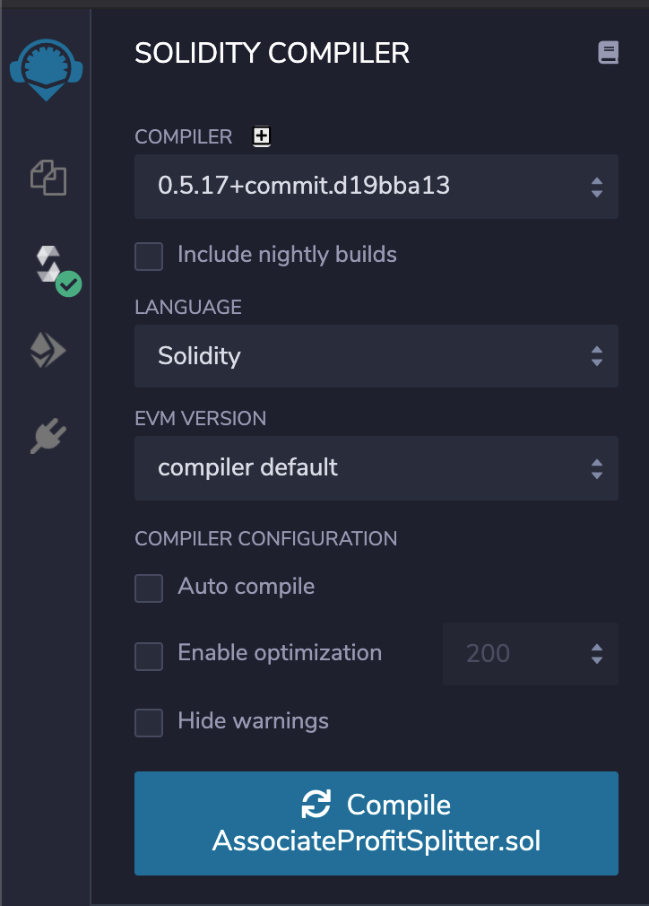

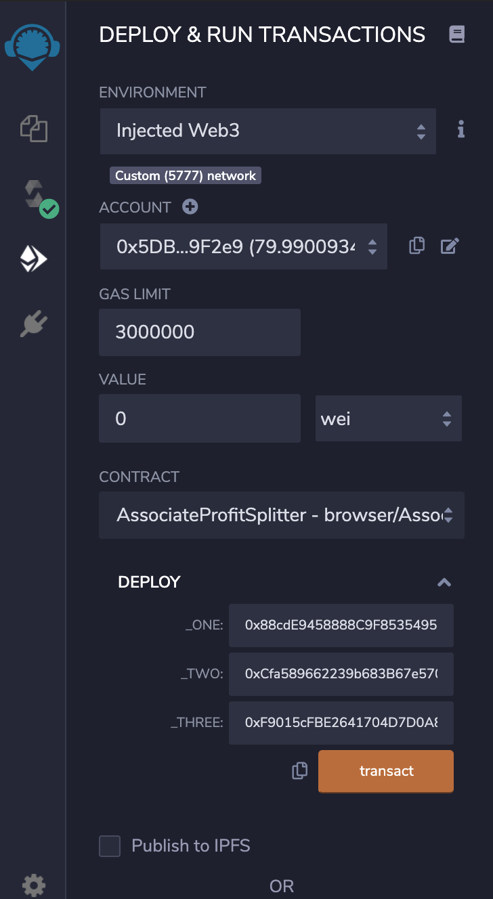

* We verify in Ganache that contract has been created.

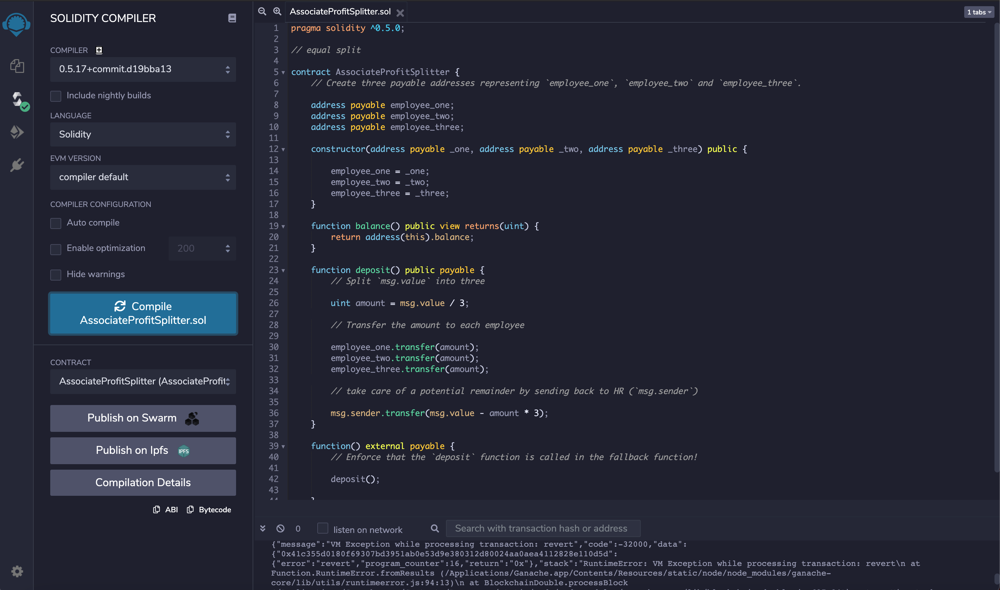

* Next step is to deposit intro contract 10 ETH which will be equally split between three selected Associates' accounts.

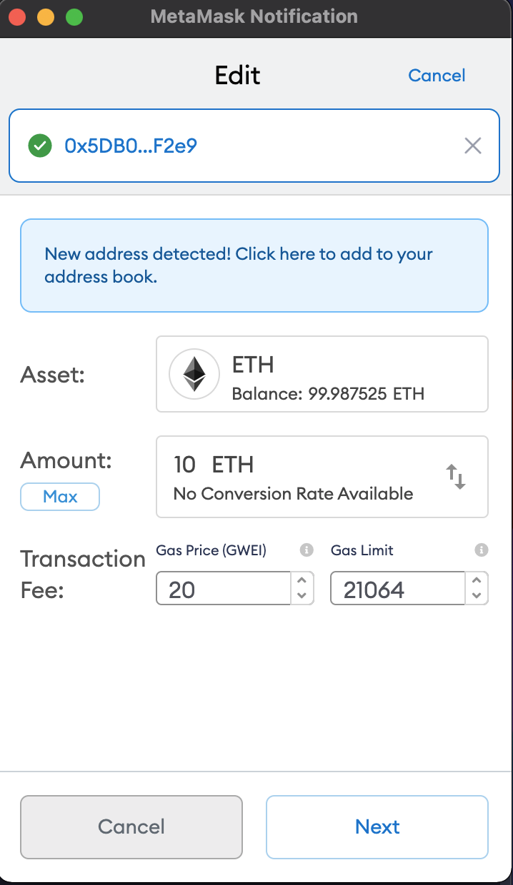

* Finally, we verify that 10 ETH has been taken out of the sender's account (0x5DB....) and deposited into three split accounts (0x88c...,0xCfa...,0xF90...).

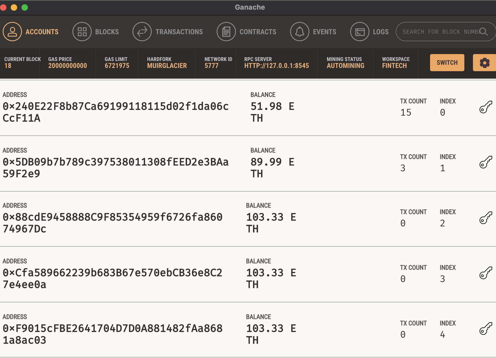

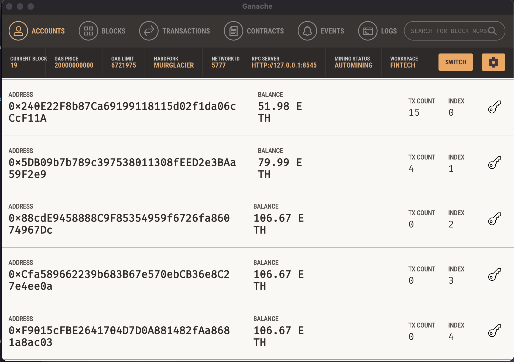

#
## Tiered Profit Splitter

* This smart contract will distribute different percentages of incoming Ether to employees at different tiers/levels. 

* For example, the CEO gets paid 60%, CTO 25%, and Bob gets 15%.

* Same as in the previous example, we compile the contract in Remix IDE, deploy and verify in Ganache it has been created. 

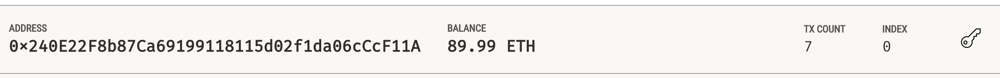

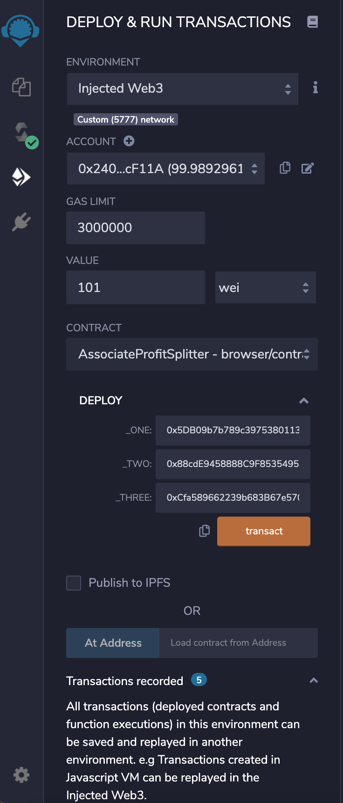

* Next, we use the deposit function to add 10 ETH that will be distributed according to pre-set percentages to other three accounts. 

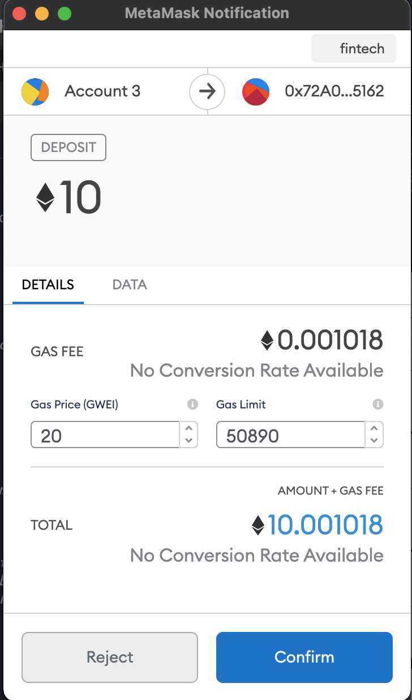

* Lastly, we compare account balances before and after the deposit transaction.

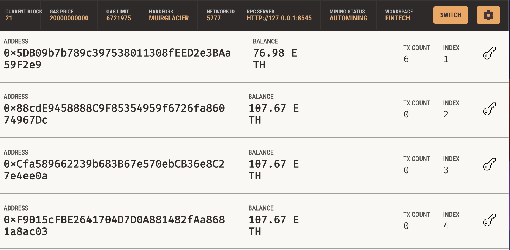

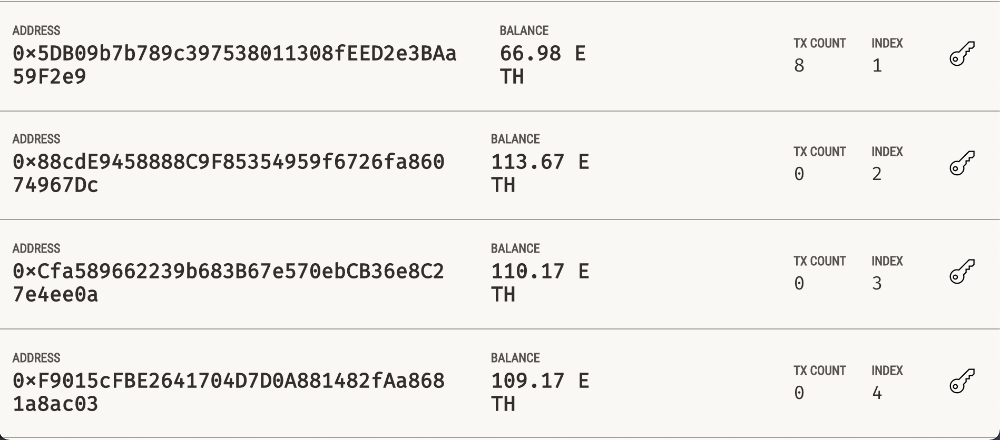

#
## Deferred Equity Plan

* This smart contract will model traditional company stock plans. 

* It will automatically manage 1000 shares with an annual distribution of 250 over 4 years for a single employee.

* As in the previous two examples, we create a contract using Remix IDE, deploy the contract, verify its creation in Ganache and finally test the share distribution function. 

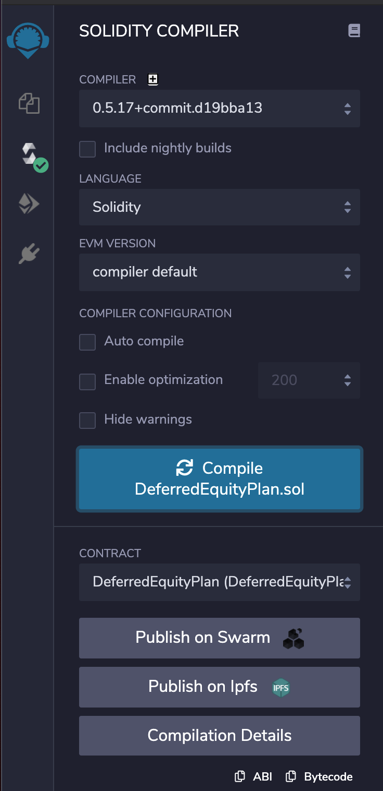

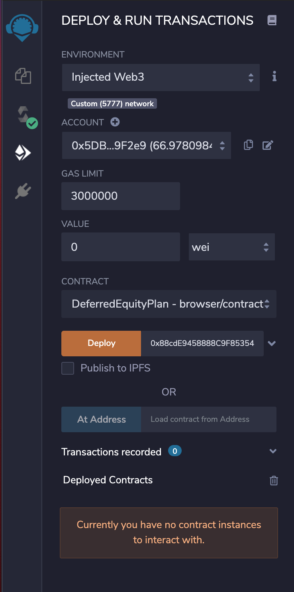

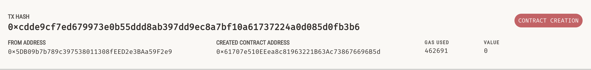

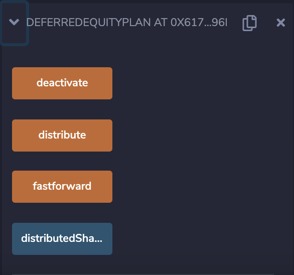

#
© 2021 Author: Dragan Bogatic

