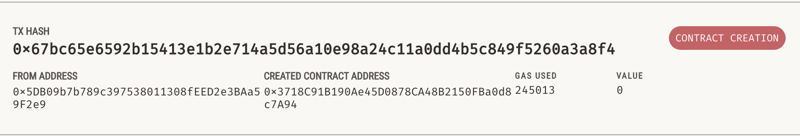
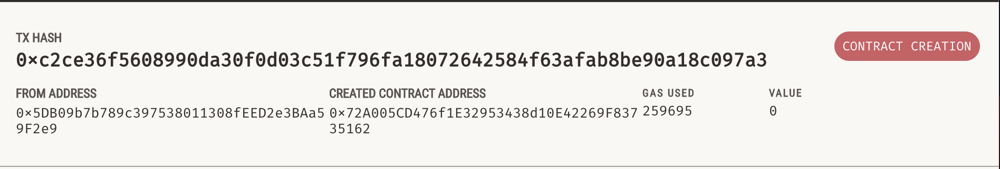
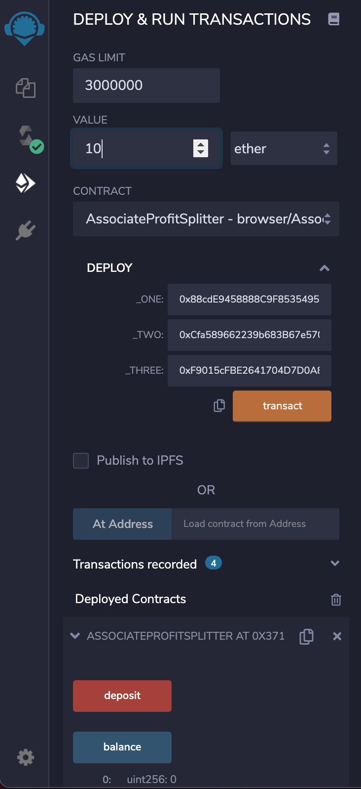

# Profit Splitter 

## Smart Contracts with Solidity, Remix IDE, MetaMask and Ganache
#

This repo shows three examples of Ethereum Smart Contracts which were created in [Solidity](https://docs.soliditylang.org/en/v0.7.4/) programming language in [Remix](https://remix-project.org/) and deployed via [MetaMask](https://metamask.io/) to [Ganache](https://www.trufflesuite.com/ganache). 
#

* [AssociateProfit Splitter](#associate-profit-splitter)

* [Tiered Profit Splitter](#tiered-profit-splitter)

* [Deferred Equity Plan](#deferred-equity-plan)

#
## Associate Profit Splitter
#

* This smart contract will accept Ether into the contract and divide the Ether evenly among the associate level employees. 

* It will allow the Human Resources department to pay employees quickly and efficiently.

* Once we created a contract in Solidity, we compile it and then deploy.

* We check the balance in the account we will be sending funds from (99.99).

* Next, we initiate a deposit transaction to one of the Associate's designated accounts to receive funds.

* Then, we confirm the deposit transaction and receive a confirmation in Ganache.

* We see that funds were taken from the sender's account balance.

#
## Tiered Profit Splitter
#
* This smart contract will distribute different percentages of incoming Ether to employees at different tiers/levels. 

* For example, the CEO gets paid 60%, CTO 25%, and Bob gets 15%.
#
## Deferred Equity Plan
#
* This smart contract will model traditional company stock plans. 

* This contract will automatically manage 1000 shares with an annual distribution of 250 over 4 years for a single employee.

#
© 2021 Author: Dragan Bogatic

